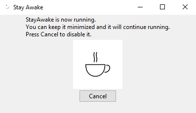

# StayAwake
Python GUI to keep the computer active and awake by pressing the F15 key every 2 minutes



## Setup
Install dependencies
```
pip install pipenv
pipenv run install
```

Run app
```
pipenv run start
```

### Note
On Linux (Currently using Rocky 9) python3-tkinter, python3-devel, and scrot need to be installed for as dependences for pyautogui.

Enable EPEL to install scrot
```
sudo dnf config-manager --set-enabled crb
sudo dnf install epel-release
```
Then install the packages
```
sudo dnf install -y python3-tkinter python3-devel scrot
```